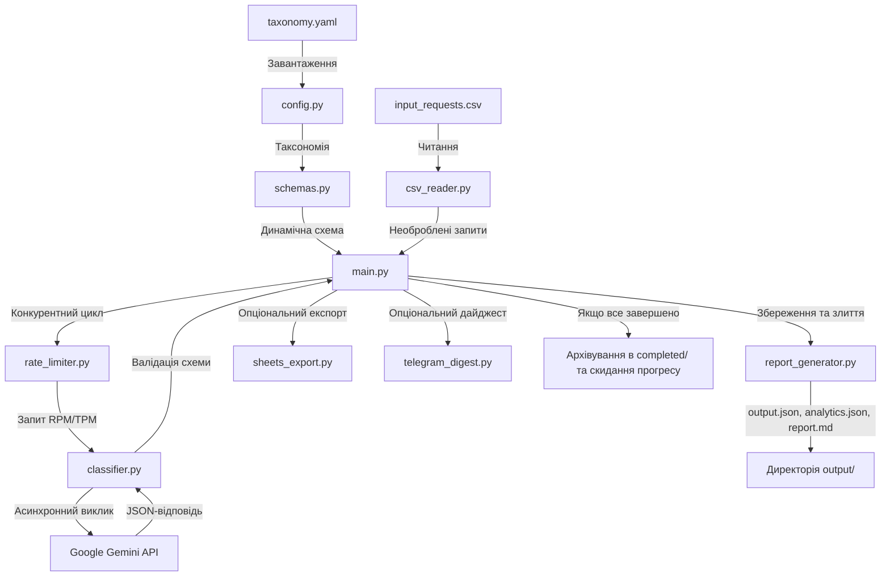
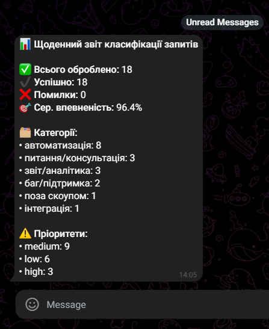

# Сервіс класифікації внутрішніх запитів на базі AI

CLI-сервіс для автоматичної класифікації та маршрутизації вхідних запитів за допомогою Google Gemini API та динамічної YAML-таксономії.

## 📊 Архітектура та потік даних



## 🌟 Ключові функції

1. **Динамічна валідація схем Pydantic v2:** Схема моделі (`ClassifiedRequest`) генерується під час виконання на основі файлу `settings/taxonomy.yaml` за допомогою патернів `Annotated` та `AfterValidator`. Схема передається в параметр `response_schema` Gemini для відповідності структурі на рівні API.
2. **Ковзний лімітер швидкості (Sliding Window Rate Limiter):** Контролює ліміти RPM (запитів на хвилину) та TPM (токенів на хвилину). Превентивно призупиняє виконання при наближенні до лімітів для запобігання помилкам HTTP 429.
3. **Обробка помилок та повторні спроби (Tenacity Retry):** Повторює виклики API до 3 разів при мережевих помилках або помилках валідації. При остаточній невдачі зберігає запис із прапорцем `processing_error=True` та описом помилки.
4. **Збереження прогресу (Progress Checkpointing):** Зберігає стан обробки у файлі `output/progress.json` для відновлення роботи після переривання без повторної обробки запитів.
5. **Асинхронна оркестрація:** Використовує `asyncio.Semaphore(5)` для конкурентної обробки запитів та обмеження кількості одночасних викликів API.
6. **Опціональні інтеграції:** Експорт результатів у Google Таблиці та надсилання звітів у Telegram. Інтеграції пропускаються, якщо в `.env` відсутні відповідні налаштування.
7. **Автоматичне архівування:** Після успішної обробки вхідного CSV-файлу результати переносяться в папку `completed/` з часовою міткою, а трекер прогресу видаляється для очищення робочої області.
8. **Зовнішній шаблон промпту:** Системний промпт винесений у файл `settings/prompt_template.txt`. Використовує іменовані плейсхолдери для динамічної підстановки даних.

## 🛠️ Встановлення та налаштування

### Системні вимоги
- Python >= 3.11
- Менеджер пакетів `uv` або `pip`
- API-ключ Google Gemini

### 1. Клонування репозиторію
```bash
git clone https://github.com/Satori8/RequestClassifier.git
cd RequestClassifier
```

### 2. Встановлення залежностей
З використанням `uv`:
```bash
uv sync
```
З використанням `pip`:
```bash
pip install -r pyproject.toml
```

### 3. Налаштування змінних оточення
Скопіюйте файл `.env.example` у `.env` та вкажіть ваш API-ключ Gemini:
```bash
cp .env.example .env
```

Налаштування файлу `.env`:
```env
GOOGLE_API_KEY=your-api-key-here
INPUT_CSV_PATH=input_requests.csv
PROMPT_TEMPLATE_PATH=settings/prompt_template.txt
MODEL_NAME=gemini-3.1-flash-lite
TEMPERATURE=0.0
MAX_OUTPUT_TOKENS=1024
RPM_LIMIT=15
TPM_LIMIT=250000
SEMAPHORE_LIMIT=5
MAX_RETRIES=3

# Опціональні інтеграції
GOOGLE_SHEETS_CREDENTIALS_PATH=
GOOGLE_SHEETS_SPREADSHEET_ID=
TELEGRAM_BOT_TOKEN=
TELEGRAM_CHAT_ID=
```

## 🚀 Запуск сервісу

Запуск локально:
```bash
python -m src.main
```
Або через `uv`:
```bash
uv run python -m src.main
```

### Робочий процес виконання:
1. Читання вхідних запитів із CSV-файлу.
2. Завантаження шаблону системного промпту з `settings/prompt_template.txt`.
3. Пропуск оброблених запитів за допомогою `output/progress.json`.
4. Конкурентна класифікація нових запитів через Google Gemini.
5. Збереження результатів у `output/output.json` та аналітики у `output/analytics.json`.
6. Експорт у Google Таблиці та Telegram (якщо налаштовано).
7. Перенесення згенерованих файлів у папку `completed/` з часовою міткою та скидання трекера прогресу.

## 🐳 Запуск через Docker

Запуск сервісу в Docker-контейнері за допомогою Docker Compose:
```bash
docker-compose up --build
```

## 🧪 Запуск тестів

Для запуску тестів виконайте:
```bash
uv run pytest -v
```

## 📂 Структура проекту

```
├── .env.example              # Шаблон змінних оточення
├── Dockerfile                # Збірка Docker на базі uv
├── docker-compose.yml        # Конфігурація Docker Compose
├── pyproject.toml            # Залежності та конфігурація проекту
├── input_requests.csv        # Вхідний CSV-файл із запитами
├── completed/                # Папка для архівування результатів
├── settings/
│   ├── taxonomy.yaml         # Налаштування категорій, відділів та пріоритетів
│   └── prompt_template.txt   # Зовнішній шаблон системного промпту
├── src/
│   ├── __init__.py
│   ├── config.py             # Завантажувач конфігурації та таксономії
│   ├── schemas.py            # Динамічна фабрика схем Pydantic
│   ├── csv_reader.py         # Читач CSV-файлів
│   ├── progress.py           # Трекер прогресу обробки
│   ├── rate_limiter.py       # Ковзний лімітер швидкості
│   ├── classifier.py         # Класифікатор Google Gemini
│   ├── report_generator.py   # Генератор звітів JSON та Markdown
│   ├── sheets_export.py      # Модуль експорту в Google Таблиці
│   ├── telegram_digest.py    # Модуль відправки дайджестів у Telegram
│   └── main.py               # Точка входу та оркестрація процесу
└── tests/                    # Набір тестів для всіх модулів
```

## 📊 Звіти та аналітика

Сервіс генерує три вихідні файли в директорії `output/`, які після успішного завершення переносяться в папку `completed/`:

1. **`output/output.json`**: Список усіх оброблених запитів. Невдалі запити зберігаються з прапорцем `processing_error=True` та описом помилки.
2. **`output/analytics.json`**: Агрегована статистика запуску, розподіл запитів за категоріями, відділами, пріоритетами, середня оцінка впевненості та кількість використаних токенів (`tokens_used`).
3. **`output/report.md`**: Текстовий звіт, що містить таблиці агрегованих показників та окрему таблицю із запитами, які потребують уточнення (`confidence_score < 0.8` або `needs_clarification = True`).

### Розширення схеми `ClassifiedRequest`

До базової схеми класифікації додано 4 поля для покращення якості контролю:

| Поле | Тип | Призначення |
|---|---|---|
| `confidence_score` | float 0.0-1.0 | Оцінка впевненості моделі. Запити з показником < 0.8 маркуються для ручної перевірки оператором |
| `clarification_questions` | list[str] | Перелік питань для уточнення, сформованих моделлю при `needs_clarification = True` |
| `estimated_complexity` | low / medium / high | Оцінка складності запиту для планування ресурсів |
| `language` | str (uk / en) | Мова оригінального запиту |

## 🔌 Налаштування інтеграцій

### Інтеграція з Google Таблицями (Sheets)
Реалізовано автоматичний експорт результатів у таблицю. Приклад заповненої Google Таблиці з оригінальним текстом запиту (`raw_text`): [Приклад Google Sheets](https://docs.google.com/spreadsheets/d/1x904mhfUgIHXlZ3PVQrF1n766MhChK_DlGzDxheTXUo/edit?gid=0#gid=0).

Порядок налаштування:
1. Увімкніть **Google Sheets API** та **Google Drive API** в Google Cloud Console.
2. Створіть сервісний акаунт, згенеруйте ключ у форматі JSON та збережіть його як `settings/google_credentials.json`.
3. Створіть Google Таблицю та надайте права редактора email-адресі сервісного акаунта.
4. Вкажіть параметри в `.env`:
   ```env
   GOOGLE_SHEETS_CREDENTIALS_PATH=settings/google_credentials.json
   GOOGLE_SHEETS_SPREADSHEET_ID=your-spreadsheet-id-here
   ```

### Інтеграція з Telegram
Реалізовано надсилання звітів у Telegram. Приклад отриманого дайджесту:



Порядок налаштування:
1. Створіть бота через `@BotFather` та отримайте токен.
2. Отримайте ваш `chat_id` за допомогою `@userinfobot` або `@GetMyChatID_Bot`.
3. Вкажіть параметри в `.env`:
   ```env
   TELEGRAM_BOT_TOKEN=your-bot-token
   TELEGRAM_CHAT_ID=your-chat-id
   ```

## 🧠 Обмеження та обробка граничних випадків

### 1. Невалідний або непередбачуваний вивід LLM (Invalid LLM Output)
* **Проблема:** Модель може повернути невалідний JSON або вигадати категорію чи департамент, яких немає в таксономії.
* **Рішення:**
  * **API-Enforced Schema Compliance:** Динамічно згенерована схема Pydantic передається безпосередньо в параметр `response_schema` Gemini API. Це змушує модель повертати JSON, який відповідає структурі схеми на рівні самого API-движка.
  * **Валідація та Tenacity Retry:** При помилках валідації або мережевих збоях виконується до 3 повторних спроб з експоненціальним бек-оффом.
  * **Graceful Degradation:** Якщо всі спроби вичерпано, запис зберігається в `output.json` з прапорцем `processing_error=True` та описом помилки. Процес обробки не зупиняється.

### 2. Великі обсяги даних та ліміти API (Large Volumes & Rate Limits)
* **Проблема:** При обробці великої кількості запитів безкоштовний тарифний план Gemini API повертає помилку HTTP 429 через обмеження 15 RPM (запитів на хвилину) та 250 000 TPM (токенів на хвилину).
* **Рішення:**
  * **Sliding-Window Rate Limiter:** Лімітер швидкості відстежує витрату RPM та TPM у кожному ковзному вікні. Сервіс призупиняє виконання при наближенні до лімітів, запобігаючи виникненню помилок HTTP 429.
  * **Семафор:** Конкурентність обмежена до 5 одночасних запитів за допомогою `asyncio.Semaphore`.
  * **Progress Checkpointing:** Стан обробки зберігається в реальному часі в `progress.json` для відновлення роботи з місця зупинки.

### 3. Недетермінізм моделей (Non-Determinism)
* **Проблема:** Один і той самий запит може бути класифікований по-різному під час різних запусків через ймовірнісну природу LLM.
* **Рішення:**
  * **Температура 0.0:** Параметр температури зафіксовано на значенні 0.0 для максимальної детермінованості виводу.
  * **Pydantic-валідатори:** Схема використовує `AfterValidator` для перевірки значень за списками з `taxonomy.yaml`. Некоректні ідентифікатори відхиляються на етапі парсингу, що ініціює повторну спробу.

### 4. Финансова вартість токенів (Token Cost & Budgeting)
* **Проблема:** Фінансова вартість токенів не обмежується в коді. При великих обсягах сумарні витрати можуть перевищити бюджет.
* **Рішення та перспективи:**
  * **Трекінг токенів:** Інформація про кількість використаних вхідних та вихідних токенів зберігається в `ProcessingResult` та агрегується в `analytics.json`.
  * **Бюджетні ліміти:** У майбутньому планується впровадження модуля розрахунку вартості та лімітів бюджету на сесію з автоматичною зупинкою при досягненні ліміту.

---

## 🚀 Перспективи розвитку (What We Would Do Next)

1. **Гаряче перезавантаження таксономії (Dynamic Taxonomy Hot-Reloading):** Автоматичне відстеження змін у файлі `taxonomy.yaml` через `watchdog` та перезавантаження правил класифікації без перезапуску сервісу.
2. **Побудова графа зв'язків (Advanced Dependency Mapping):** Детекція та зв'язування дублікатів чи пов'язаних запитів безпосередньо в схемі виводу з можливістю візуалізації у вигляді графа залежностей.
3. **Локальний AI-движок (Ollama / Local LLM Support):** Додавання підтримки локальних моделей (наприклад, Llama 3 або Mistral через Ollama) для забезпечення конфіденційності даних та роботи без мережі.
4. **Векторний пошук дублікатів (Vector Semantic Search):** Індексування текстів запитів у векторній базі даних (наприклад, ChromaDB або Qdrant) для знаходження семантично схожих запитів перед відправкою в LLM.
5. **Веб-інтерфейс аналітики (Web Dashboard):** Створення інтерфейсу (наприклад, на Streamlit або FastAPI) для перегляду класифікованих запитів, фільтрації та відображення графіків аналітики.

---

## 📜 Ліцензія

Проект ліцензований на умовах MIT License - деталі див. у файлі [LICENSE](LICENSE).