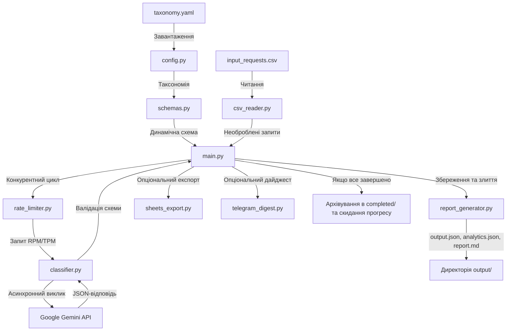

# Сервіс автоматичної класифікації внутрішніх запитів на базі AI

<p align="center">
  <a href="https://www.python.org/">
    
  </a>
  <a href="https://github.com/googleapis/python-genai">
    
  </a>
  <a href="https://github.com/astral-sh/uv">
    
  </a>
  <a href="https://github.com/Satori8/RequestClassifier/actions">
    
  </a>
  <a href="https://github.com/psf/black">
    
  </a>
  <a href="LICENSE">
    
  </a>
</p>

Асинхронний, високонадійний CLI-сервіс на базі Python, який автоматично класифікує, структурує та маршрутизує вхідні внутрішні запити за допомогою передової моделі **Google Gemini 3.1 Flash Lite** та гнучкої YAML-таксономії.

---

## 📊 Архітектура системи та потік даних



---

## 🌟 Ключові особливості

1. **Динамічна фабрика схем Pydantic v2:** Динамічно генерує схему Pydantic (`ClassifiedRequest`) під час виконання за допомогою патернів `Annotated` та `AfterValidator` на основі завантаженої таксономії з `settings/taxonomy.yaml`. Вона передається безпосередньо в `response_schema` Gemini для 100% відповідності структурі на рівні API.
2. **Ковзний лімітер швидкості (Sliding Window Rate Limiter):** Реалізує потокобезпечний ковзний лімітер швидкості для RPM (запитів на хвилину) та TPM (токенів на хвилину), який превентивно призупиняє виконання та логує попередження при наближенні до лімітів, запобігаючи помилкам HTTP 429 на безкоштовному тарифі Gemini (15 RPM, 250 000 TPM).
3. **Надійна обробка помилок та повторні спроби (Tenacity Retry):** Повторює невдалі виклики LLM до 3 разів з експоненціальним бек-оффом при транзитних помилках (наприклад, ліміти швидкості або помилки валідації). Якщо всі спроби вичерпано, запис зберігається з прапорцем `processing_error=True` та описом помилки, гарантуючи відсутність мовчазних втрат даних.
4. **Збереження прогресу та відновлення (Progress Checkpointing):** Зберігає стан обробки в JSON-файл (`output/progress.json`), що дозволяє безперешкодно відновлювати перервані запуски без повторної класифікації вже оброблених запитів.
5. **Асинхронна оркестрація:** Обробляє запити конкурентно за допомогою `asyncio.Semaphore(5)` для обмеження кількості одночасних викликів API та оптимізації швидкості роботи.
6. **Опціональні інтеграції:** Експорт результатів безпосередньо в Google Таблиці та надсилання щоденних звітів/дайджестів у Telegram. Обидві інтеграції деградують граціозно і просто пропускаються, якщо в `.env` відсутні відповідні налаштування.
7. **Архівування завершених файлів:** Після успішної обробки всіх запитів із вхідного CSV-файлу вихідні файли безпечно архівуються в директорію `completed/` з унікальною часовою міткою, а трекер прогресу скидається. Це запобігає перезапису результатів попередніх успішних запусків і дозволяє почати наступний запуск з чистого аркуша.
8. **Зовнішній шаблон промпту:** Системний промпт, що надсилається до LLM, повністю винесений у зовнішній файл `settings/prompt_template.txt`. Він використовує іменовані плейсхолдери (`{categories}`, `{departments}`, `{priority_rules}`, `{batch_context}`) для динамічної підстановки, що дозволяє промпт-інженерам налаштовувати логіку без зміни Python-коду.

---

## 🛠️ Встановлення та налаштування

### Попередні вимоги
- Python >= 3.11
- [uv](https://github.com/astral-sh/uv) (рекомендовано) або `pip`
- API-ключ Google Gemini

### 1. Клонування репозиторію
```bash
git clone https://github.com/Satori8/RequestClassifier.git
cd RequestClassifier
```

### 2. Встановлення залежностей
Використовуючи `uv` (найшвидше):
```bash
uv sync
```

Оригінальний `pip`:
```bash
pip install -r pyproject.toml
```

### 3. Налаштування змінних оточення
Скопіюйте файл `.env.example` у `.env` та вкажіть ваш API-ключ Gemini:
```bash
cp .env.example .env
```

Відредагуйте `.env`:
```env
GOOGLE_API_KEY=your-api-key-here
INPUT_CSV_PATH=input_requests.csv
PROMPT_TEMPLATE_PATH=settings/prompt_template.txt
MODEL_NAME=gemini-3.1-flash-lite
TEMPERATURE=0.0
MAX_OUTPUT_TOKENS=1024
RPM_LIMIT=15
TPM_LIMIT=250000
SEMAPHORE_LIMIT=5
MAX_RETRIES=3

# Опціональні інтеграції
GOOGLE_SHEETS_CREDENTIALS_PATH=
GOOGLE_SHEETS_SPREADSHEET_ID=
TELEGRAM_BOT_TOKEN=
TELEGRAM_CHAT_ID=
```

---

## 🚀 Запуск сервісу

Щоб запустити сервіс класифікації локально:
```bash
python -m src.main
```

Або за допомогою `uv`:
```bash
uv run python -m src.main
```

### Робочий процес виконання (Execution Workflow):
1. Читання вхідних запитів із налаштованого CSV-файлу (за замовчуванням: `input_requests.csv`).
2. Завантаження шаблону системного промпту з налаштованого шляху (за замовчуванням: `settings/prompt_template.txt`).
3. Пропуск уже оброблених запитів за допомогою `output/progress.json`.
4. Конкурентна класифікація необроблених запитів через Google Gemini.
5. Збереження результатів у `output/output.json` та аналітики у `output/analytics.json`.
6. Запуск опціональних інтеграцій з Google Таблицями та Telegram, якщо вони налаштовані.
7. Якщо всі запити успішно оброблені, перенесення згенерованих вихідних файлів (`output/output.json`, `output/analytics.json` та `output/report.md`) у папку `completed/` з часовою міткою (наприклад, `completed/output_20260617_122608.json`) та скидання трекера прогресу. Це архівує результати та дозволяє наступному запуску почати роботу повністю з чистого аркуша.

---

## 🐳 Запуск через Docker

Ви можете запустити сервіс у Docker-контейнері за допомогою Docker Compose. Це монтує локальні директорії як томи, тому вихідні файли зберігаються безпосередньо на вашій хост-машині.

### 1. Збірка та запуск
```bash
docker-compose up --build
```

---

## 🧪 Запуск тестів

Ми маємо повний набір тестів зі 100% покриттям ключових модулів.

Щоб запустити тести:
```bash
uv run pytest -v
```

---

## 📂 Структура проекту

```
├── .env.example              # Шаблон змінних оточення
├── Dockerfile                # Багатоетапна збірка Docker на базі uv
├── docker-compose.yml        # Конфігурація Docker Compose
├── pyproject.toml            # Залежності та конфігурація проекту
├── input_requests.csv        # Вхідний CSV-файл із запитами
├── completed/                # Папка, куди архівуються завершені вихідні файли
├── settings/
│   ├── taxonomy.yaml         # Налаштування категорій, відділів та правил пріоритетів
│   └── prompt_template.txt   # Зовнішній шаблон системного промпту з плейсхолдерами
├── src/
│   ├── __init__.py
│   ├── config.py             # Завантажувач конфігурації та парсер таксономії
│   ├── schemas.py            # Динамічна фабрика схем Pydantic
│   ├── csv_reader.py         # Читач CSV-файлів
│   ├── progress.py           # Трекер збереження прогресу
│   ├── rate_limiter.py       # Ковзний лімітер швидкості
│   ├── classifier.py         # Класифікатор Google Gemini з повторними спробами
│   ├── report_generator.py   # Генератор агрегованих звітів JSON та Markdown
│   ├── sheets_export.py      # Опціональний експортер у Google Таблиці
│   ├── telegram_digest.py    # Опціональний відправник дайджестів у Telegram
│   └── main.py               # Точка входу оркестрації та цикл конкурентності
└── tests/
    ├── test_config.py
    ├── test_schemas.py
    ├── test_csv_reader.py
    ├── test_progress.py
    ├── test_rate_limiter.py
    ├── test_classifier.py
    ├── test_report_generator.py
    ├── test_integrations.py
    └── test_main.py
```

---

## 📊 Звіти та аналітика

Під час виконання сервіс класифікації генерує три вихідні файли в директорії `output/`. Після успішного завершення обробки всіх запитів ці файли автоматично переносяться в папку `completed/` з додаванням унікальної часової мітки (наприклад, `output_YYYYMMDD_HHMMSS.json`), щоб зберегти історію запусків та очистити робочу область для наступного запуску:

1. **`output/output.json`**: Повний список усіх оброблених запитів. Кожен запис відповідає схемі динамічної таксономії. Якщо запит не вдалося обробити, він зберігається з прапорцем `processing_error=True` та деталями помилки (без мовчазних втрат).
2. **`output/analytics.json`**: Агрегована статистика запуску, включаючи:
   - Загальну кількість запитів, успішних та невдалих.
   - Розподіл кількості за категоріями, відділами та пріоритетами.
   - Середню оцінку впевненості.
   - **`tokens_used`**: Загальну кількість вхідних, вихідних та сумарних токенів, використаних Gemini API за час запуску.
3. **`output/report.md`**: Короткий, зручний для читання людиною markdown-звіт, що містить:
   - Таблиці агрегованих показників.
   - **Запити, що потребують уточнення**: Окрема таблиця з усіма запитами, які мають `needs_clarification = True` (позначені LLM) **АБО** мають `confidence_score < 0.8`. Це дозволяє операторам швидко виявляти розпливчасті, невпевнені або позаскоупні запити та бачити згенеровані моделлю питання для уточнення.

### Розширення схеми `ClassifiedRequest`

Оригінальна схема з ТЗ вимагала 6 полів: `category`, `target_department`, `priority`, `short_summary`, `requested_actions`, `needs_clarification`.

Ми додали 4 поля:

| Поле | Тип | Навіщо |
|---|---|---|
| `confidence_score` | float 0.0–1.0 | Самооцінка LLM впевненості. Запити з score < 0.8 потрапляють у report.md як потенційно помилкові → тригер для human review замість сліпої довіри моделі |
| `clarification_questions` | list[str] | Перетворює булевий `needs_clarification` з пасивного прапорця на actionable output — менеджер одразу бачить що саме запитати у автора запиту, без додаткового аналізу |
| `estimated_complexity` | low / medium / high | Допомагає при плануванні спринтів — PM бачить орієнтовну складність ще до того, як задача потрапляє в беклог |
| `language` | str (uk / en) | Фіксує мову запиту. В CSV є мікс українських і англійських текстів — знання мови корисне для маршрутизації та локалізації відповідей |

**Принцип**: кожне поле або покращує якість контролю (confidence, clarification questions), або додає корисниі метаданні для downstream процесів (complexity, language). Жодне поле не ускладнює промпт суттєво — все витягується в одному LLM-виклику без додаткових запитів.

---

## 🔌 Налаштування інтеграцій

Сервіс містить опціональні, готові до продакшену інтеграції з Google Таблицями та Telegram-дайджестами. Обидві інтеграції успішно реалізовані, протестовані та готові до роботи! Вони граціозно деградують і просто пропускаються, якщо їх конфігурації відсутні в `.env`.

### 🟢 Інтеграція з Google Таблицями (Sheets)
Успішно реалізовано автоматичний експорт класифікованих запитів у таблицю. Приклад налаштованої та заповненої Google Таблиці (яка містить класифіковані дані разом із оригінальним текстом запиту `raw_text`): [Приклад Google Sheets](https://docs.google.com/spreadsheets/d/1x904mhfUgIHXlZ3PVQrF1n766MhChK_DlGzDxheTXUo/edit?gid=0#gid=0).

Щоб експортувати класифіковані запити безпосередньо в Google Таблицю:

1. **Створіть сервісний акаунт Google (Service Account):**
   - Перейдіть у [Google Cloud Console](https://console.cloud.google.com/).
   - Увімкніть **Google Sheets API** та **Google Drive API** для вашого проекту.
   - Перейдіть у розділ **IAM & Admin -> Service Accounts** та натисніть **Create Service Account**.
   - Перейдіть на вкладку **Keys**, натисніть **Add Key -> Create new key**, виберіть **JSON** та завантажте файл.
   - Збережіть цей JSON-файл у папці вашого проекту (наприклад, як `settings/google_credentials.json`).
2. **Створіть Google Таблицю:**
   - Створіть нову Google Таблицю у вашому браузері.
   - Скопіюйте ID таблиці з URL-адреси:
     `https://docs.google.com/spreadsheets/d/`**`SPREADSHEET_ID`**`/edit`
3. **Надайте доступ сервісному акаунту:**
   - Відкрийте завантажений JSON-файл та скопіюйте `"client_email"` (закінчується на `@...gserviceaccount.com`).
   - У вашій Google Таблиці натисніть кнопку **Share (Поділитися)** у правому верхньому кутку, вставте скопійований email та надайте права **Редактора (Editor)**.
4. **Налаштуйте `.env`:**
   ```env
   GOOGLE_SHEETS_CREDENTIALS_PATH=settings/google_credentials.json
   GOOGLE_SHEETS_SPREADSHEET_ID=your-spreadsheet-id-here
   ```

### 🔵 Інтеграція з Telegram
Успішно реалізовано автоматичне надсилання красивого україномовного HTML-дайджесту запуску. 

Приклад отриманого дайджесту в Telegram із загальною статистикою та списком запитів, що потребують уточнення:


Щоб отримувати гарно відформатований HTML-дайджест запуску українською мовою у ваш Telegram:

1. **Створіть Telegram-бота:**
   - Відкрийте Telegram та знайдіть бота `@BotFather`.
   - Надішліть команду `/newbot` і дотримуйтесь інструкцій, щоб отримати **Токен бота (Bot Token)** (наприклад, `123456789:ABCdefGhIJKlmNoPQRsTUVwxyZ`).
   - Перейдіть за посиланням на вашого нового бота та натисніть **Start** (надішліть `/start`).
2. **Отримайте ваш Telegram `chat_id`:**
   - **Спосіб А (Найпростіший):** Знайдіть у Telegram бота `@userinfobot` або `@GetMyChatID_Bot`, натисніть **Start**, і він миттєво надішле вам ваш числовий `chat_id` (наприклад, `987654321`).
   - **Спосіб Б (Через браузер):** Відкрийте веб-браузер та перейдіть за посиланням:
     `https://api.telegram.org/bot<YOUR_BOT_TOKEN>/getUpdates`
     Знайдіть поле `"chat":{"id":987654321,...}` у відповіді JSON. (Якщо список порожній, надішліть боту ще одне повідомлення в Telegram та оновіть сторінку).
3. **Налаштуйте `.env`:**
   ```env
   TELEGRAM_BOT_TOKEN=123456789:ABCdefGhIJKlmNoPQRsTUVwxyZ
   TELEGRAM_CHAT_ID=987654321
   ```

---

## 🧠 Обмеження, Граничні випадки та Стратегії запобігання (Limitations & Edge Cases)

У цьому розділі описано технічні виклики, потенційні точки відмови системи та способи їхнього нівелювання.

### 1. Невалідний або непередбачуваний вивід LLM (Invalid LLM Output)
* **Проблема:** Модель може повернути невалідний JSON або вигадати категорію/департамент, яких немає в таксономії.
* **Рішення:**
  * **API-Enforced Schema Compliance:** Ми передаємо динамічно згенеровану схему Pydantic безпосередньо в параметр `response_schema` клієнта Gemini API (разом із `response_mime_type="application/json"`). Це примусово змушує модель повертати JSON, який на 100% відповідає структурі нашої схеми на рівні самого API-движка.
  * **Валідація «на льоту» та Tenacity Retry:** Якщо валідація все ж провалилася (наприклад, через збій мережі або розбіжність схеми), блок `_call_llm_with_retry` здійснює до **3 повторних спроб** з експоненціальним бек-оффом.
  * **Graceful Degradation (Без мовчазних втрат):** Якщо всі спроби вичерпано, запис зберігається в `output.json` з прапорцем `processing_error=True` та повним логом помилки. Сервіс не падає, а продовжує обробку черги.

### 2. Великі обсяги даних та ліміти API (Large Volumes & Rate Limits)
* **Проблема:** При обробці тисяч запитів безкоштовний тарифний план Gemini API швидко поверне помилку HTTP 429 (Too Many Requests), оскільки діє суворе обмеження: **15 RPM** (запитів на хвилину) та **250 000 TPM** (токенів на хвилину).
* **Рішення:**
  * **Sliding-Window Rate Limiter:** Створено потокобезпечний та асинхронний лімітер швидкості, який паралельно відстежує витрату лімітів RPM та TPM у кожному ковзному вікні. Якщо ліміт наближається до критичного, сервіс превентивно призупиняє виконання та логує попередження, повністю запобігаючи виникненню HTTP 429.
  * **Семафор (`asyncio.Semaphore`):** Паралельність обмежена до **5 одночасних запитів**, що оптимізує навантаження на систему та мережу.
  * **Progress Checkpointing:** Увесь прогрес зберігається в реальному часі в `progress.json`. У разі переривання роботи (наприклад, вимкнення світла або збою хоста) наступний запуск продовжить обробку з останнього неналаштованого запиту.

### 3. Недетермінізм моделей (Non-Determinism)
* **Проблема:** Оскільки LLM є ймовірнісними моделями, один і той самий запит може бути класифікований по-різному під час різних запусків.
* **Рішення:**
  * **Температура `0.0`:** Параметр температури жорстко зафіксовано на значенні `0.0`, що робить вивід максимально детермінованим та повторюваним.
  * **Суворі Pydantic-валідатори:** Динамічна схема використовує `AfterValidator` для перевірки значень за списками з `taxonomy.yaml`. Навіть якщо модель спробує згенерувати некоректний ID, Pydantic відхилить його на етапі парсингу, ініціюючи повторну спробу.

### 4. Фінансова вартість токенів (Token Cost & Budgeting)
* **Проблема:** Наразі фінансова вартість токенів (у грошовому еквіваленті) ніяк не обробляється та не обмежується в коді. Оскільки ми відмовилися від батч-обробки та класифікуємо запити поодинці, вартість кожного виклику є невеликою, але при великих обсягах сумарні витрати можуть перевищити очікуваний бюджет.
* **Рішення / Перспектива:**
  * **Трекінг токенів:** Ми вже збираємо та зберігаємо точну інформацію про кількість використаних вхідних (`prompt_token_count`) та вихідних (`candidates_token_count`) токенів у `ProcessingResult` та агрегуємо їх в `analytics.json`.
  * **Механізм розрахунку вартості:** На основі зібраних даних можна легко впровадити модуль розрахунку вартості (наприклад, множачи кількість токенів на офіційні тарифи моделі за 1M токенів).
  * **Бюджетні ліміти:** У майбутньому можна додати параметри лімітів бюджету на день, сесію або місяць (наприклад, `DAILY_BUDGET_USD=5.00`), при досягненні яких сервіс превентивно зупинятиме роботу, захищаючи від неочікуваних витрат.

---

## 🚀 Перспективи розвитку (What We Would Do Next)

Якби на розробку було виділено більше часу, наступними кроками стали б:

1. **Гаряче перезавантаження таксономії (Dynamic Taxonomy Hot-Reloading):** Автоматичне відстеження змін у файлі `taxonomy.yaml` через `watchdog` та перезавантаження правил класифікації на льоту без перезапуску CLI-сервісу.
2. **Побудова графа зв'язків (Advanced Dependency Mapping):** Повноцінна детекція та зв'язування дублікатів/пов'язаних запитів (наприклад, зв'язування `REQ-013` -> `REQ-001`) безпосередньо в схемі виводу з можливістю візуалізації у вигляді графа залежностей.
3. **Локальний AI-движок (Ollama / Local LLM Support):** Додавання підтримки локальних моделей (наприклад, Llama 3 або Mistral через Ollama) як альтернативи Gemini для повної конфіденційності та роботи без підключення до мережі.
4. **Векторний пошук дублікатів (Vector Semantic Search):** Індексування текстів запитів у векторній базі даних (наприклад, ChromaDB або Qdrant) для миттєвого знаходження семантично схожих запитів у реальному часі перед відправкою в LLM.
5. **Веб-інтерфейс аналітики (Web Dashboard):** Створення легкого веб-інтерфейсу (наприклад, на Streamlit або FastAPI + Tailwind) для зручного перегляду класифікованих запитів, пошуку, фільтрації та інтерактивних графіків аналітики.

---

## 📜 Ліцензія

Цей проект ліцензований на умовах MIT License - деталі див. у файлі [LICENSE](LICENSE).
