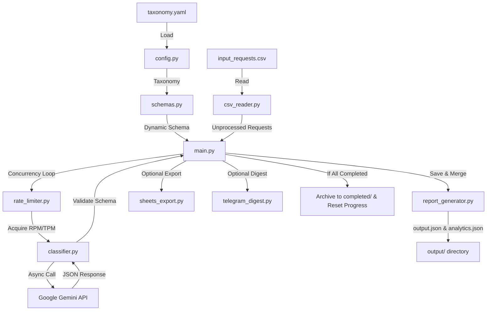

# AI-Powered Internal Request Classifier Service

<p align="center">
  <a href="https://www.python.org/">
    
  </a>
  <a href="https://github.com/googleapis/python-genai">
    
  </a>
  <a href="https://github.com/astral-sh/uv">
    
  </a>
  <a href="https://github.com/Satori8/RequestClassifier/actions">
    
  </a>
  <a href="https://github.com/psf/black">
    
  </a>
  <a href="LICENSE">
    
  </a>
</p>

An asynchronous, highly resilient Python-based CLI service that automatically classifies, structures, and routes incoming internal requests using the state-of-the-art **Google Gemini 3.1 Flash Lite** model and a highly configurable YAML taxonomy.

---

## 📊 System Architecture & Data Flow



---

## 🌟 Key Features

1. **Dynamic Pydantic Schema Factory:** Dynamically generates the Pydantic schema (`ClassifiedRequest`) at runtime using Pydantic v2 `Annotated` and `AfterValidator` patterns based on the loaded taxonomy from `settings/taxonomy.yaml`. This is passed directly to Gemini's `response_schema` for 100% API-enforced schema compliance.
2. **Sliding Window Rate Limiter:** Implements a thread-safe sliding-window RPM (Requests Per Minute) and TPM (Tokens Per Minute) rate limiter that proactively pauses execution and logs warnings when approaching limits to prevent HTTP 429 errors on Gemini's free tier (15 RPM, 250,000 TPM limit).
3. **Robust Error Handling & Tenacity Retry:** Retries failed LLM calls up to 3 times with exponential backoff on transient errors (e.g., rate limits, validation errors). If all retries fail, it saves the request with a `processing_error=True` flag and the error details, ensuring no silent drops.
4. **Progress Checkpointing & Resume:** Maintains a JSON-based progress file (`output/progress.json`) to allow resuming interrupted runs seamlessly without re-processing already-classified requests.
5. **Asynchronous Orchestration:** Processes requests concurrently using `asyncio.Semaphore(5)` to limit concurrent API calls and optimize speed.
6. **Optional Integrations:** Export results directly to Google Sheets and send daily aggregated reports/digests via Telegram. Both integrations degrade gracefully if credentials or configurations are missing.
7. **Completed File Archiving:** Once all requests in the input CSV are successfully processed, the output files are safely archived in the `completed/` directory with a unique timestamp, and the progress tracker is reset. This prevents overwriting previous successful runs and ensures the next run starts fresh.

---

## 🛠️ Installation & Setup

### Prerequisites
- Python >= 3.11
- [uv](https://github.com/astral-sh/uv) (recommended) or `pip`
- Google Gemini API Key

### 1. Clone the Repository
```bash
git clone https://github.com/Satori8/RequestClassifier.git
cd RequestClassifier
```

### 2. Install Dependencies
Using `uv` (fastest):
```bash
uv sync
```

Or using standard `pip`:
```bash
pip install -r pyproject.toml
```

### 3. Configure Environment Variables
Copy `.env.example` to `.env` and fill in your Gemini API key:
```bash
cp .env.example .env
```

Edit `.env`:
```env
GOOGLE_API_KEY=your-api-key-here
INPUT_CSV_PATH=input_requests.csv
MODEL_NAME=gemini-3.5-flash
TEMPERATURE=0.0
MAX_OUTPUT_TOKENS=1024
RPM_LIMIT=15
TPM_LIMIT=1000000
SEMAPHORE_LIMIT=5
MAX_RETRIES=3

# Optional integrations
GOOGLE_SHEETS_CREDENTIALS_PATH=
GOOGLE_SHEETS_SPREADSHEET_ID=
TELEGRAM_BOT_TOKEN=
TELEGRAM_CHAT_ID=
```

---

## 🚀 Running the Service

To run the classifier service locally:
```bash
python -m src.main
```

Or using `uv`:
```bash
uv run python -m src.main
```

### Execution Workflow:
1. Read the input requests from the configured CSV path (default: `input_requests.csv`).
2. Skip already processed requests using `output/progress.json`.
3. Classify unprocessed requests concurrently using Google Gemini.
4. Save the results to `output/output.json` and analytics to `output/analytics.json`.
5. Run optional Google Sheets and Telegram integrations if configured.
6. If all requests are successfully processed, move the generated output files (`output/output.json` and `output/analytics.json`) to the `completed/` folder with a date/time timestamp (e.g., `completed/output_20260617_122608.json`) and reset the progress tracker. This archives the results and allows subsequent runs to start completely fresh.

---

## 🐳 Running with Docker

You can run the service inside a Docker container using Docker Compose. This mounts the local directories as volumes, so output files are saved directly to your host machine.

### 1. Build and Run
```bash
docker-compose up --build
```

---

## 🧪 Running Tests

We have a comprehensive test suite with 100% test coverage of core modules.

To run the tests:
```bash
uv run pytest -v
```

---

## 📂 Project Structure

```
├── .env.example              # Environment variables template
├── Dockerfile                # Multi-stage Docker build using uv
├── docker-compose.yml        # Docker Compose configuration
├── pyproject.toml            # Project dependencies and configuration
├── input_requests.csv        # Input requests CSV file
├── completed/                # Folder where completed output files are archived
├── settings/
│   └── taxonomy.yaml         # Configurable categories, departments, and priority rules
├── src/
│   ├── __init__.py
│   ├── config.py             # Configuration loader and taxonomy parser
│   ├── schemas.py            # Dynamic Pydantic schema factory
│   ├── csv_reader.py         # CSV file reader
│   ├── progress.py           # Progress checkpointing tracker
│   ├── rate_limiter.py       # Sliding window rate limiter
│   ├── classifier.py         # Google Gemini classifier with tenacity retry
│   ├── report_generator.py   # Aggregated JSON report generator
│   ├── sheets_export.py      # Optional Google Sheets exporter
│   ├── telegram_digest.py    # Optional Telegram digest sender
│   └── main.py               # Orchestration entrypoint & concurrency loop
└── tests/
    ├── test_config.py
    ├── test_schemas.py
    ├── test_csv_reader.py
    ├── test_progress.py
    ├── test_rate_limiter.py
    ├── test_classifier.py
    ├── test_report_generator.py
    ├── test_integrations.py
    └── test_main.py
```

---

## 🧠 Обмеження, Граничні випадки та Стратегії запобігання (Limitations & Edge Cases)

У цьому розділі описано технічні виклики, потенційні точки відмови системи та способи їхнього нівелювання.

### 1. Невалідний або непередбачуваний вивід LLM (Invalid LLM Output)
* **Проблема:** Модель може повернути невалідний JSON або вигадати категорію/департамент, яких немає в таксономії.
* **Рішення:**
  * **API-Enforced Schema Compliance:** Ми передаємо динамічно згенеровану схему Pydantic безпосередньо в параметр `response_schema` клієнта Gemini API (разом із `response_mime_type="application/json"`). Це примусово змушує модель повертати JSON, який на 100% відповідає структурі нашої схеми на рівні самого API-движка.
  * **Валідація «на льоту» та Tenacity Retry:** Якщо валідація все ж провалилася (наприклад, через збій мережі або розбіжність схеми), блок `_call_llm_with_retry` здійснює до **3 повторних спроб** з експоненціальним бек-оффом.
  * **Graceful Degradation (Без мовчазних втрат):** Якщо всі спроби вичерпано, запис зберігається в `output.json` з прапорцем `processing_error=True` та повним логом помилки. Сервіс не падає, а продовжує обробку черги.

### 2. Великі обсяги даних та ліміти API (Large Volumes & Rate Limits)
* **Проблема:** При обробці тисяч запитів безкоштовний тарифний план Gemini API швидко поверне помилку HTTP 429 (Too Many Requests), оскільки діє суворе обмеження: **15 RPM** (запитів на хвилину) та **250 000 TPM** (токенів на хвилину).
* **Рішення:**
  * **Sliding-Window Rate Limiter:** Створено потокобезпечний та асинхронний лімітер швидкості, який паралельно відстежує витрату лімітів RPM та TPM у кожному ковзному вікні. Якщо ліміт наближається до критичного, сервіс превентивно призупиняє виконання та логує попередження, повністю запобігаючи виникненню HTTP 429.
  * **Семафор (`asyncio.Semaphore`):** Паралельність обмежена до **5 одночасних запитів**, що оптимізує навантаження на систему та мережу.
  * **Progress Checkpointing:** Увесь прогрес зберігається в реальному часі в `progress.json`. У разі переривання роботи (наприклад, вимкнення світла або збою хоста) наступний запуск продовжить обробку з останнього неналаштованого запиту.

### 3. Недетермінізм моделей (Non-Determinism)
* **Проблема:** Оскільки LLM є ймовірнісними моделями, один і той самий запит може быть класифікований по-різному під час різних запусків.
* **Рішення:**
  * **Температура `0.0`:** Параметр температури жорстко зафіксовано на значенні `0.0`, що робить вивід максимально детермінованим та повторюваним.
  * **Суворі Pydantic-валідатори:** Динамічна схема використовує `AfterValidator` для перевірки значень за списками з `taxonomy.yaml`. Навіть якщо модель спробує згенерувати некоректний ID, Pydantic відхилить його на етапі парсингу, ініціюючи повторну спробу.

### 4. Фінансова вартість токенів (Token Cost & Budgeting)
* **Проблема:** Наразі фінансова вартість токенів (у грошовому еквіваленті) ніяк не обробляється та не обмежується в коді. Оскільки ми відмовилися від батч-обробки та класифікуємо запити поодинці, вартість кожного виклику є невеликою, але при великих обсягах сумарні витрати можуть перевищити очікуваний бюджет.
* **Рішення / Перспектива:**
  * **Трекінг токенів:** Ми вже збираємо та зберігаємо точну інформацію про кількість використаних вхідних (`prompt_token_count`) та вихідних (`candidates_token_count`) токенів у `ProcessingResult` та агрегуємо їх в `analytics.json`.
  * **Механізм розрахунку вартості:** На основі зібраних даних можна легко впровадити модуль розрахунку вартості (наприклад, множачи кількість токенів на офіційні тарифи моделі за 1M токенів).
  * **Бюджетні ліміти:** У майбутньому можна додати параметри лімітів бюджету на день, сесію або місяць (наприклад, `DAILY_BUDGET_USD=5.00`), при досягненні яких сервіс превентивно зупинятиме роботу, захищаючи від неочікуваних витрат.

---

## 🚀 Перспективи розвитку (What We Would Do Next)

Якби на розробку було виділено більше часу, наступними кроками стали б:

1. **Гаряче перезавантаження таксономії (Dynamic Taxonomy Hot-Reloading):** Автоматичне відстеження змін у файлі `taxonomy.yaml` через `watchdog` та перезавантаження правил класифікації на льоту без перезапуску CLI-сервісу.
2. **Побудова графа зв'язків (Advanced Dependency Mapping):** Повноцінна детекція та зв'язування дублікатів/пов'язаних запитів (наприклад, зв'язування `REQ-013` -> `REQ-001`) безпосередньо в схемі виводу з можливістю візуалізації у вигляді графа залежностей.
3. **Локальний AI-движок (Ollama / Local LLM Support):** Додавання підтримки локальних моделей (наприклад, Llama 3 або Mistral через Ollama) як альтернативи Gemini для повної конфіденційності та роботи без підключення до мережі.
4. **Векторний пошук дублікатів (Vector Semantic Search):** Індексування текстів запитів у векторній базі даних (наприклад, ChromaDB або Qdrant) для миттєвого знаходження семантично схожих запитів у реальному часі перед відправкою в LLM.
5. **Веб-інтерфейс аналітики (Web Dashboard):** Створення легкого веб-інтерфейсу (наприклад, на Streamlit або FastAPI + Tailwind) для зручного перегляду класифікованих запитів, пошуку, фільтрации та інтерактивних графіків аналітики.

---

## 📜 License

This project is licensed under the MIT License - see the [LICENSE](LICENSE) file for details.
